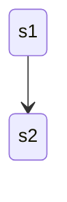

# Trio typed behaviors

`Trio Typed Behaviors` or `TTB` brings Akka like typed behaviors to Python on top of the trio library.

<!-- an introduction about Pyctor and its use cases -->
Pyctor is a library that allows you to write actors in Python using the trio library. 
It is inspired by Akka Typed Behaviors.
Its main use case is to write concurrent applications that are easy to reason about.
It can be used to write microservices, distributed systems, or even games.
Performance is not a goal of this library, but it is not a goal to sacrifice performance either.
Instead correctness and ease of use are the main goals.

# Inspiration

- Akka Typed Behaviors
- Tractor (helped a lot to see get multiprocess to work)