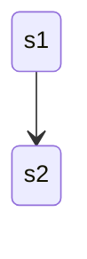

# Trio typed behaviors

`Trio Typed Behaviors` or `TTB` brings Akka like typed behaviors to Python on top of the trio library.

# Inspiration

- Akka Typed Behaviors
- Tractor (helped a lot to see get multiprocess to work)