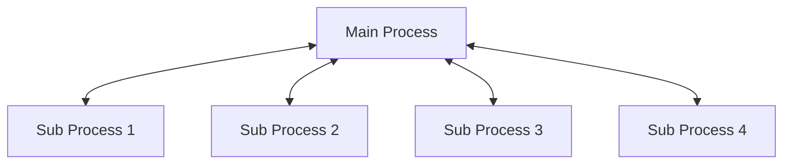

# Trio Typed Behaviors: Multiprocessing

## General architecture

Multiprocessing is implemented via subprocesses. There is one main process and `n` number of subprocesses, where all communication is done over TCP on localhost.

The number of subprocesses can be controlled when creating a behavior nursery. Each subprocess belongs to a behavior nursery and will not be shared with other behavior nurseries.

This means that if you have two behavior nurseries, each with 2 subprocesses, you will have 4 subprocesses in total.

### Communication

When a multi process behavior nursery is used, the main process will not be used for spawning any behaviors, instead the main process will only manage the communication between the different processes.

Additionally, messages passing between the sub processes are routed via the main process. While this is not the most efficient solution, right now it is the easiest one.

## Main Process architecture

When a behavior nursery with multiple processes is initially created, the main process will start a server behavior that is responsible to manage all connections to the sub processes.

For that it starts a TCP server on a random port. 
It will then spawn the sub processes as a separate python script and provides the port of the server of the main process. 

When a sub process connects to the server two behaviors will be spawned:
- A behavior to send messages to the sub process
- A behavior to listen to messages from the subprocess and rerouting them in the system.

### Server Send Behavior

This behavior is responsible to send messages to the sub process. It will receive messages from the main process and send them to the sub process.
If needed, it will transform the messages to the correct format to be send on the wire and to be understood from the receiving end.

### Server Receive Behavior

This behavior is responsible to receive messages from the sub process and reroute them to the main process. Depending on the message type different actions will be taken.

## Sub process architecture

The subprocess is started as a separate python script. It will connect to the server of the main process and set itself up to receive messages from the main process.

First the encoder and decoder will be send to the sub process. 
Then the sub process will spawn a behavior to listen to messages from the main process and a behavior to send messages to the main process.

### Subprocess Send Behavior

This behavior is responsible to send messages to the main process. It will receive messages from any behavior in the sub process and send them to the main process, transforming the messages if needed.

### Subprocess Receive Behavior

This behavior is responsible to receive messages from the main process and reroute them to the correct behavior. Depending on the message type different actions will be taken.