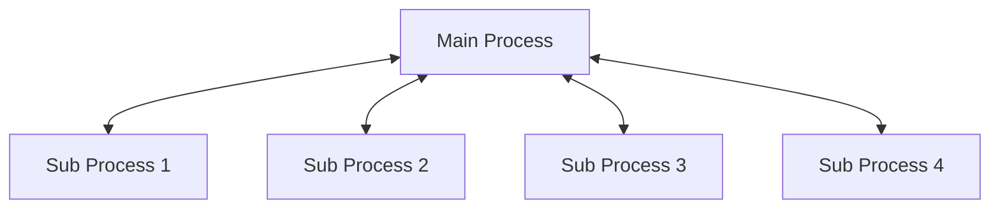
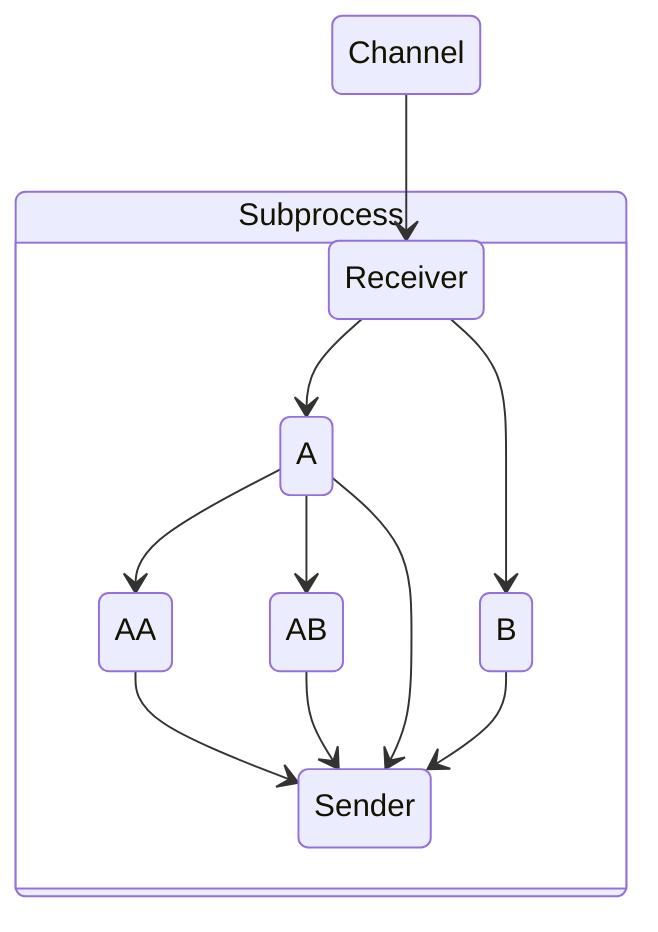

# Trio Typed Behaviors: Multiprocessing

## General architecture

Multiprocessing is implemented via subprocesses. There is one main process and n number of subprocesses, where the communication is done over TCP on localhost.

The number of subprocesses is the same as the number of cores on the node but this can be controlled when creating multiprocess nurseries.

In this case the main process is responsible for sending messages to the sub processes and will not take part in spawning any behaviors.

Messages passing between the sub processes are routed via the main process. While this is not the most efficient solution, right now it is the easiest one.

## Main Process architecture

The main process starts a TCP server on a random port to communicate with the sub processes. 
It will then spawn a sub process and provides the port of the server of the main process. As soon as the sub process connects to the server two behaviors will be spawned:
- A behavior to send messages to the sub process
- A behavior to listen to messages from the subprocess and rerouting them in the system. 

## Sub process architecture

